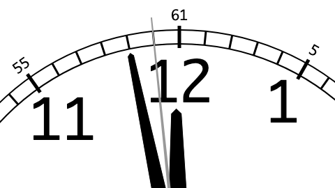

Compact formats for the leap second list
========================================

_warning: work in progress_

The goal is to make it really easy to distribute the list of leap
seconds, by making the list really small and easy to read and write.

The binary leap second list is smaller than typical cryptographic
authentication codes, so it should be cheap enough for time servers to
include it in most responses.

In the first half of 2021, the text format looks like this. (The line
break is not part of the format; it's just for presentation purposes
in this README.) It is currently 82 characters; I expect it will
remain less than 100 characters for the next 20 years.

        6+6+12+12+12+12+12+12+12+18+12+12+24+30+24+
        12+18+12+12+18+18+18+84+36+42+36+18+59?

The binary format looks like this. (Represented as a hex dump rather
than raw binary.) It is currently 16 bytes, and may grow past 20 bytes
in the next 20 years.

        00111111 12113431 2112229D 565287FA

These leap second lists are cryptographically signed and published in
the DNS at `leapsecond.dotat.at`.

code
----

This repository contains a Rust library and program for reading and
writing the leap seconds list in various formats, including:

  * a compact text format
  * a compact binary format
  * the NIST `leap-seconds.list` format

It is intended to be a reference implementation.

spec
----

The specification for the compact leap second list text and binary
formats can be found in [doc/spec.md](doc/spec.md).

licence
-------

> This was written by Tony Finch <<dot@dotat.at>>  
> You may do anything with it. It has no warranty.  
> <https://creativecommons.org/publicdomain/zero/1.0/>  
> SPDX-License-Identifier: CC0-1.0
